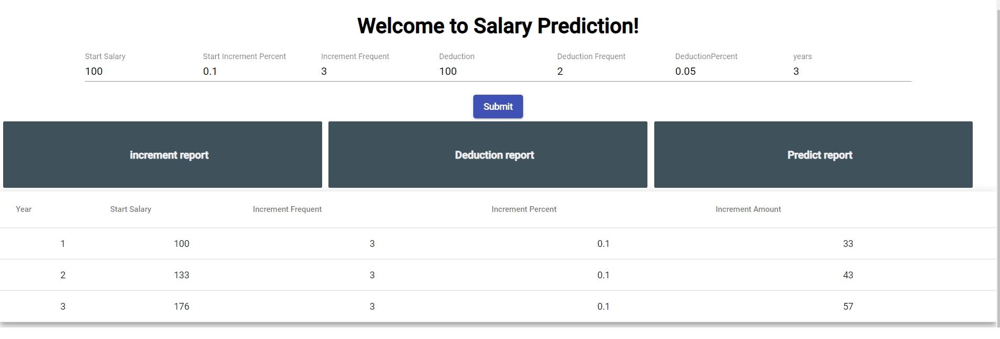
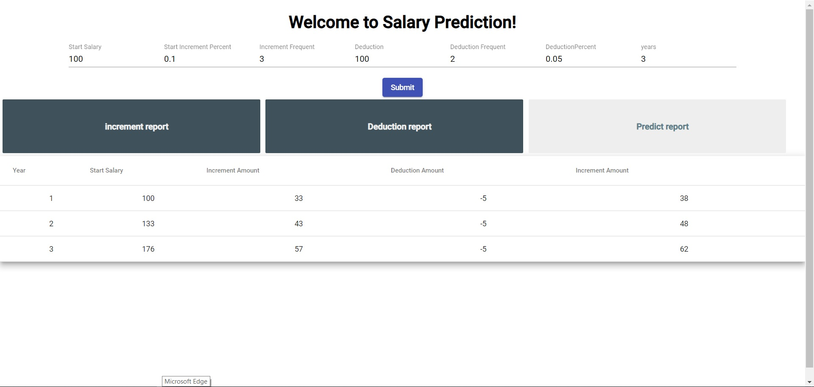

# FSD assignment-4
I have front-end and back-end for this assignment. 
The front-end is to show the input of the data and show the reports.
The back-end is to process the caculation of the salary. 

Please find below screenshots for the demo:

